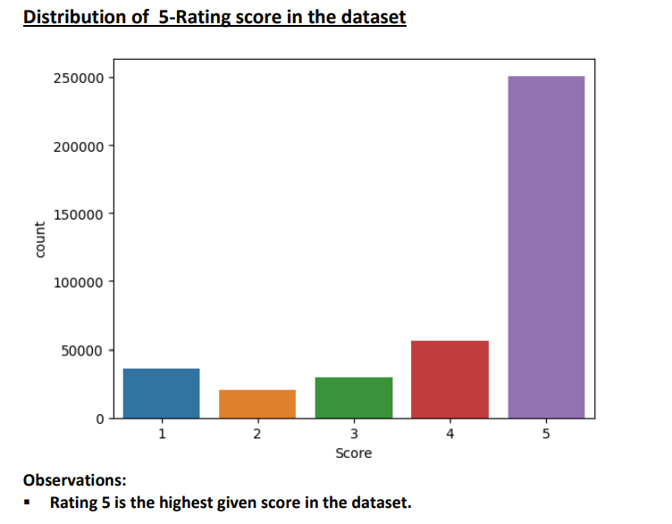
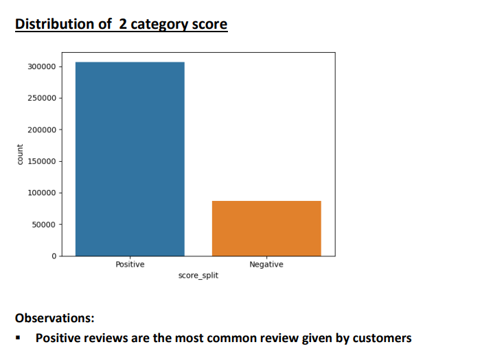
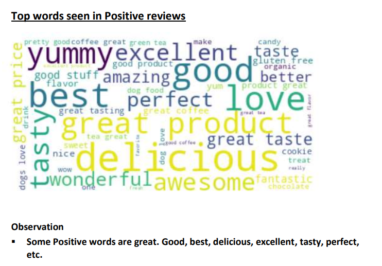
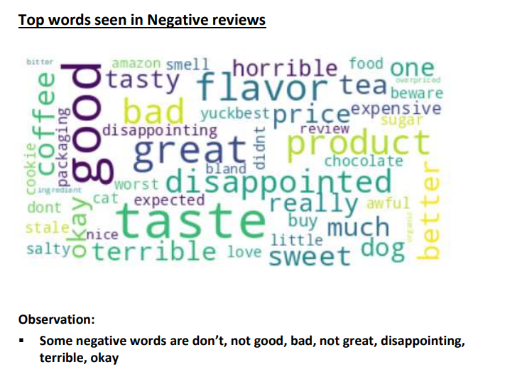
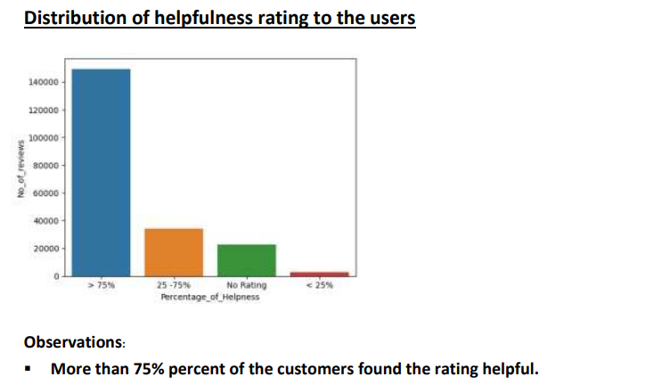
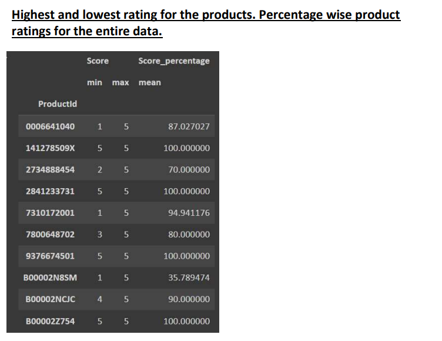
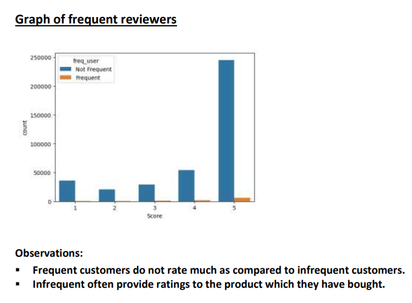
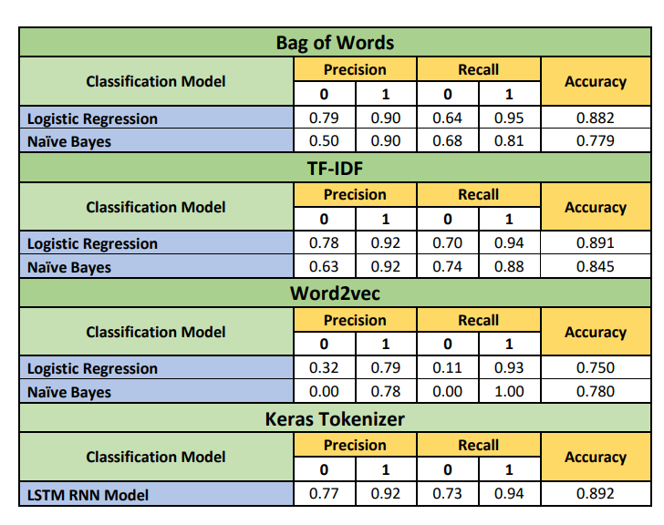

# Sentiment Analysis with LSTM RNN

## Overview

This project focuses on sentiment analysis for customer reviews using Long Short-Term Memory (LSTM) Recurrent Neural Network (RNN) with Keras Tokenizer. Gain insights into customer sentiments and classify reviews as positive or negative.

## Dataset Details

The Reviews.csv dataset contains 568,454 rows and 10 columns, including key information such as product ID, user ID, ratings, and review text.

### Column Details

1. **ID:** Unique number to identify a single product review.
2. **ProductId:** Unique number to identify a product.
3. **UserId:** Unique number to identify a user.
4. **ProfileName:** Name of the user.
5. **HelpfulnessNumerator:** Number of ratings found helpful.
6. **HelpfulnessDenominator:** Number of ratings given by users for the product.
7. **Score:** Rating score given by a customer.
8. **Time:** Time at which the user gave the review.
9. **Summary:** Summary of the user's review.
10. **Text:** Entire text of the user's review.

## Preprocessing Steps

1. **Load Data from Kaggle:**
   - Import the dataset containing customer reviews for Amazon products.

2. **Exploratory Data Analysis and Text Cleaning:**
   - Check data distribution, types, and handle missing or invalid entries.
   - Remove duplicate reviews by the same user on the same product.
   - Convert ratings to two categories: Positive and Negative.
   - Remove HTML tags, tokenize, eliminate punctuation, and filter out common stopwords.

3. **Text Vectorization:**
   - Utilize Keras Tokenizer to convert text into numeric vectors for LSTM RNN model training.
   - Implement three other vectorization techniques: Bag-of-Words, TF-IDF, Word2Vec.

4. **Model Building:**
   - Implement LSTM RNN model for sentiment analysis using the Keras Tokenizer.

5. **Model Selection:**
   - Choose LSTM RNN for sentiment analysis.

## Insights and Screenshots

1. **Invalid Data Entries and Duplicate Product Reviews by Same User**
   Observation:
   - Found duplicates of products with repeating ProductId. Taking only one review per user each product
   - Found 2 invalid entries where numerator values exceeded denominator values and they are removed from the dataset.

2. **Distribution of 5-Rating Score in the Dataset**
   

3. **Distribution of 2 Category Score**
   

4. **Top Words Seen in Positive Reviews**
   

5. **Top Words Seen in Negative Reviews**
   

6. **Number of Reviews Rated by Users: 209307 out of 393917 rated reviews - 53.13 %**

7. **Distribution of Helpfulness Rating to the Users**
   

8. **Highest and Lowest Rating for the Products**
   

9. **Total Number of Reviews by Unique Profiles: 175383 / 393917**

10. **Total Number of Customers or Profiles Who Have Given Reviews for More Than One Product: 218534 / 393917**

11. **Graph of Frequent Reviewers**
    

## Model Selection

- **Logistic Regression:**
  - A simple linear model for binary classification.

- **Naive Bayes:**
  - Especially suited for text classification tasks.

- **LSTM RNN Model:**
  - A deep learning model that can capture sequential dependencies in text data.

## Evaluation Metrics

The Evaluation metrics are summarized in the Table below.

 

## License

This project is licensed under the [MIT License](LICENSE).

## How to Use

1. Clone the repository.
2. Install the required dependencies.
3. Run the Jupyter Notebook or Python script.

